# Kubernetes
* Kubernetes (k8s) is an open source orchestrator for deploying containerized applications.
* K8s provides the following features
    * Development Velocity
    *  Scaling
    *  Abstract your infrastructure
    *  Self Healing
    *  Declarative Approach
* Kubernetes is a platform that manages container-based applications, their networking and storage components.
* In Kubernetes, we focus on the application workloads rather than the underlying infrastructure.
* K8s is designed to work with any container technology.
* K8s is cluster so we interact with master nodes. 
* There are two ways of interacting, where as for       
   * k8s it exposes APIs
   * From code/restapi with json
* From command line where k8s gives a cmd line tools kubectl
* In `kubectl` can be interacted in two ways
    * imperative commands
    * declarative (yaml)
* To k8s we always express the desired state (What is that we want)
* These yaml files where we describe our desired state are called as manifests.

kubectl: kubernetes control
----------------------------
* This is a command line tool to communicate with k8s api server.
* Inside k8s we have a Certificate Authority and keys available which are used to secure all k8s communications.
* The kubeconfig file contians the certificate data to be connected securely as admin into k8s (This is based on installations which we have done so far)
  
CNI – Container Network Interface
---------------------------------
* Docker containers for networking have a Standard CNM (Container Network Model)
* CNI (Container Network Interface) is another standard which also speaks about networking to container run times [Refer Here](https://github.com/containernetworking/cni)
* CNI Plugins implement networking functionalities. In the case of k8s Networking is implemented by CNI and we have an option to choose the CNI Plugin in bare metal installations.
* CNI Plugins help kube-proxy to give a unique ip address to every Pod in the k8s cluster.
* Some of the popular CNI Plugins
   * Weave Net
   * Flannel
   * Calico
* 

Architechture
-------------
* Kubernetes has two kinds of Nodes
   * **Master:** Provides core Kubernetes Services and orchestration to application workloads
   * **Node:** run your application workloads
### Kubernetes Cluster Architecture
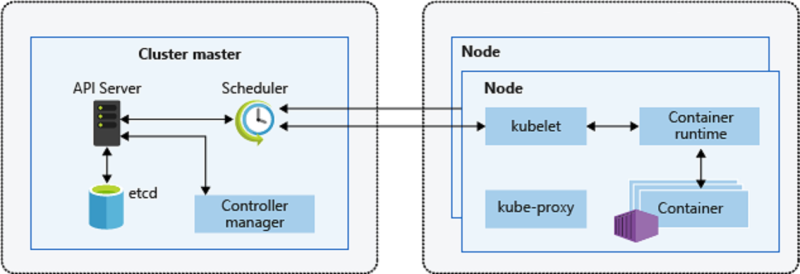
* [Refer Here](https://directdevops.blog/2019/10/10/kubernetes-master-and-node-components/) for k8s components 
* Master node has 4 components and one additional component for cloud based k8s service
1. **API Server:** 
      * Handles all the communication of k8s cluster
      * Let it be internal or external
      * kube-api server exposes functionality over HTTP(s) protocol and provides REST API
2. **etcd:** This is memory of k8s cluster
3. **Scheduler:** Scheduler is responsible for creating k8s objects and scheduling them on right node
4. **Controller:** 
     * Controller Manger is responsible for maintaining desired state
     * This reconcilation loop that checks for desired state and if it mis matches doing the necessary steps is done by controller
5. **Cloud Controller:** This is component in k8s with cloud specific knowledge
* Nodes have the following components
1. **Container runtime:** This is technology in which your container is created (docker, rkt, containerd)
2. **kube-proxy:** is responsible for networking 
3. **kubelet:** Agent that runs on nodes waiting for instructions from master and execute them.

kubectl: kubernetes control
----------------------------
* This is a command line tool to communicate with k8s api server.
* Inside k8s we have a Certificate Authority and keys available which are used to secure all k8s communications.
* The kubeconfig file contians the certificate data to be connected securely as admin into k8s (This is based on installations which we have done so far)

Installing K8s using Kube-adm
-----------------------------
* For offical documentation [Refer here](https://kubernetes.io/docs/setup/production-environment/tools/kubeadm/install-kubeadm/)
  
### Steps:
* Create 2 ec2 instances each with 2 vCPUs and 4GB RAM (t2.medium).
* Install Docker on all the nodes.
  ```
    curl -fsSL https://get.docker.com -o install-docker.sh
    sh install-docker.sh
  ```
* To install CRI-dockerd [Refer Here](https://github.com/Mirantis/cri-dockerd/releases) and get the latest releases. Below steps are specific to ubuntu 22.04.
  ```
  wget https://github.com/Mirantis/cri-dockerd/releases/download/v0.3.4/cri-dockerd_0.3.4.3-0.ubuntu-jammy_amd64.deb
  sudo dpkg -i cri-dockerd_0.3.4.3-0.ubuntu-jammy_amd64.deb
  ```
* Execute the above step on all **3 nodes**
* Install kubeadm, kubectl and kubelet on **3 nodes** [Refer Here](https://kubernetes.io/docs/setup/production-environment/tools/kubeadm/install-kubeadm/#installing-kubeadm-kubelet-and-kubectl)
* Execute the following on **3 nodes**.
  ```bash
    sudo apt-get update
    sudo apt-get install -y apt-transport-https ca-certificates curl
    curl -fsSL https://pkgs.k8s.io/core:/stable:/v1.28/deb/Release.key | sudo gpg --dearmor -o /etc/apt/keyrings/kubernetes-apt-keyring.gpg
    echo 'deb [signed-by=/etc/apt/keyrings/kubernetes-apt-keyring.gpg] https://pkgs.k8s.io/core:/stable:/v1.28/deb/ /' | sudo tee /etc/apt/sources.list.d/kubernetes.list
    sudo apt-get update
    sudo apt-get install -y kubelet kubeadm kubectl
    sudo apt-mark hold kubelet kubeadm kubectl
  ```
* Now Lets create a k8s cluster using kubeadm [Refer Here](https://kubernetes.io/docs/setup/production-environment/tools/kubeadm/create-cluster-kubeadm/)
* Execute the following on **master node**
* Lets initialize the cluster using the following command as a root user.
  ```
  kubeadm init --pod-network-cidr "10.244.0.0/16" --cri-socket "unix:///var/run/cri-dockerd.sock"
  ```
* kubeadm responds as following.
  ```
    To start using your cluster, you need to run the following as a regular user:

    mkdir -p $HOME/.kube
    sudo cp -i /etc/kubernetes/admin.conf $HOME/.kube/config
    sudo chown $(id -u):$(id -g) $HOME/.kube/config

    Alternatively, if you are the root user, you can run:

    export KUBECONFIG=/etc/kubernetes/admin.conf

    You should now deploy a pod network to the cluster.
    Run "kubectl apply -f [podnetwork].yaml" with one of the options listed at:
    https://kubernetes.io/docs/concepts/cluster-administration/addons/

    Then you can join any number of **worker nodes** by running the following on each as root:

    kubeadm join 172.31.56.247:6443 --token 4ndbar.f10zerzr0eo5qhj6 \
            --discovery-token-ca-cert-hash sha256:f65ae5933080c24a45d79a0bfd780c9af299ca13a7f069b7ed7a9fdfeadc58b0
  ```
* On the **master node** to run kubectl as regular user execute the following
    ``` 
    mkdir -p $HOME/.kube
    sudo cp -i /etc/kubernetes/admin.conf $HOME/.kube/config
    sudo chown $(id -u):$(id -g) $HOME/.kube/config
    ```
* Now as a regular user execute `kubectl get nodes`
  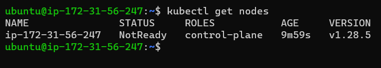
* Now as a root user in **node**  execute the join command
    ```
    kubeadm join 172.31.56.247:6443 --token 4ndbar.f10zerzr0eo5qhj6 \
            --discovery-token-ca-cert-hash sha256:f65ae5933080c24a45d79a0bfd780c9af299ca13a7f069b7ed7a9fdfeadc58b0 \
            --cri-socket "unix:///var/run/cri-dockerd.sock"
    ```
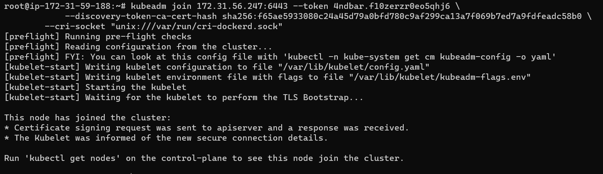
* Now execute `kubectl get nodes` from master node
 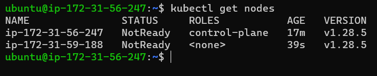
* Now kuberentes needs CNI Plugin so that pod-network is enabled. Till this is done the DNS doesnot work, services donot work so nodes are shown as NotReady.
* We can choose among wide range of CNI Plugins, For this lets use flannel. Execute the following on master node `kubectl apply -f https://github.com/flannel-io/flannel/releases/latest/download/kube-flannel.yml`
* Now execute `kubectl get nodes -w` and wait for all the nodes to get to ready state.
  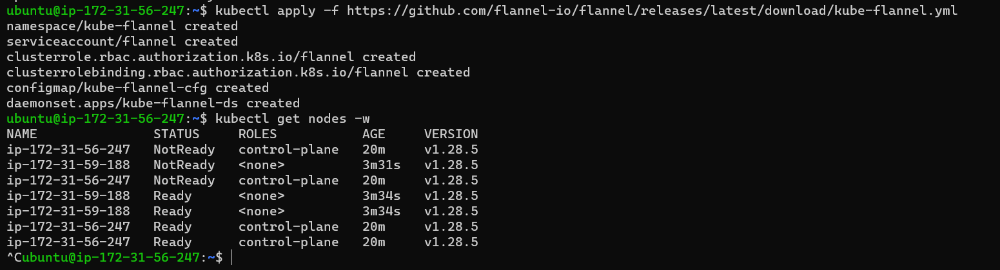
* Kubectl cheatsheet [Refer Here](https://kubernetes.io/docs/reference/kubectl/cheatsheet/)
  ```bash
    source <(kubectl completion bash) # set up autocomplete in bash into the current shell, bash-completion package should be installed first.
    echo "source <(kubectl completion bash)" >> ~/.bashrc # add autocomplete permanently to your bash shell.
  ```
* Lets setup autocomplete for kubectl
* note: use tabs
* 
  
Pods
----
* Pod is atomic unit of creation in k8s and it contains container(s). Each Pod has unique ip address. They are ephemaral(short life).
* Pod is collection of Containers.
   * Container in which we have application running is referred as main car and other are referred as side cars
  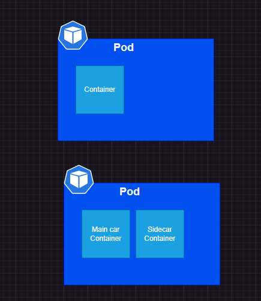

### Creating Pod Manifests
* The basic skeleton manifest which is suitable for majority of resources
  ```
    ---
    apiVersion:
    kind:
    metadata:
    spec:
  ```
* This when executed becomes 5 as k8s will add status
  ```
    ---
    apiVersion:
    kind:
    metadata:
    spec:
    status:
  ```
* API Versioning: [Refer Here](https://kubernetes.io/docs/reference/using-api/)
  * API Group [Refer Here](https://kubernetes.io/docs/reference/using-api/#api-groups)
  * version
* To fill apiVersion
```
# if the apiGroup is not core
apiVersion: <apiGroup>/<version>

# if the apiGroup is core
apiVersion: <version>
```
* To fill the rest lets use api reference Refer Here and for v1.28 the url will `https://kubernetes.io/docs/reference/generated/kubernetes-api/v1.28/` and if you are using 1.26 `https://kubernetes.io/docs/reference/generated/kubernetes-api/v1.26/`
  
### Activity 1 : Let me write a simple pod with one nginx container

```yaml
  ---
  apiVersion: v1
  kind: Pod
  metadata: 
    name: first_pod
  spec:
    containers:
      - name: nginx_pod
        image: ngnix:1.25
        ports:
          - containerPort: 80
```
* To apply the manifest we wrote `kubectl apply -f <path/to/the/manifest>`
* To delete the pods created using manifest  `kubectl delete -f <path/to/the/manifest>`. we can also delete the pods by `kubectl delete pod <podname>`

### Activity 2: Lets write a simple pod spec/manifest to run jenkins as well as nginx containers in one pod

```yaml
  ---
  apiVersion: v1
  kind: Pod
  metadata:
    name: second_pod
  spec: 
    containers:
      - image: ngnix:1.25
        name: ngnix-1
        ports:
          - containerPort: 80
      - image: jenkins/jenkins:jdk17
        name: jenkins
        ports:
          - containerPort: 8080
```

### Activity 3: Write a k8s pod manifest to run one container with alpine with cmd sleep 1d (docker container run -d alpine sleep 1d)

```yaml
  ---
  apiVersion: v1
  kind: Pod
  metadata:
    name: third-pod
  spec:
    containers:
      - image: alpine:latest
        name: alpine
        command: 
          - sleep
        arg: 
          - 1d
```
* Running two containers (1 for application and 1 for database) in a single pod is not approachable because if that pod fails our containers will also won't exist. Data will be lost or we can't access other container in that pod.
* Scaling: scaling is for pods which means multiple pods each having single container.
* Pod lifecycle: K8s Pods will have following states
  *  Pending
  *  Running
  *  Succeded
  *  Failed
  *  Unknown
* Container Restart Policy: Onfailure, Never, Always 
* Lets write a manifest which sleeps for 2 seconds (sleep 2)
   1. restart policy = Never
   2. not specify restart policy in spec
 ```yaml
  ---
  apiVersion: v1
  kind: Pod
  metadata: 
    name: restart-never
  spec: 
    containers:
      - name: restart-never
        image: alpine:latest
        command:
          - sleep
        args: 
          - "2"
    restartPolicy: Never

  ---
  apiVersion: v1
  kind: Pod
  metadata: 
    name: restart-nopolicy
  spec: 
    containers:
      - name: restart-nopolicy
        image: alpine:latest
        command:
          - sleep
        args: 
          - "2"
   
 ```

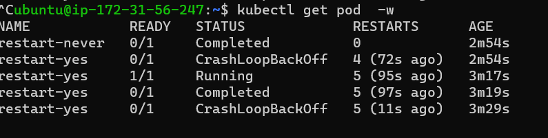

* Pods can run 3 types of containers
  **1. Containers** => Where we run our applications
  **2. init containers:**
    * These containers are created one by one and only after its completion, the normal containers are created.
    * We will use these containers for any initial setup or configuration kind of purposes
  **3. ephemeral containers:**
    * No guarantee containers, they are used rarely in the case of debugging or trouble shooting containers in Pod
* Lets create a Pod with 2 init container which sleep for 5 seconds and then in container we run nginx.
  ```yaml
  ---
  apiVersion: v1
  kind: Pod
  metadata:
    name: init-container-demo
    labels:
      app: nginx
  spec:
    initContainers:
      - image: alpine:latest
        name: init-cont1
        command:
          - sleep
          - "5"
      - image: alpine:latest
        name: init-cont2
        command:
          - sleep
          - "5"
    containers:
      - image: nginx:1.25
        name: nginx-init
        ports:
          - containerPort: 80
            protocol: TCP   
  ```
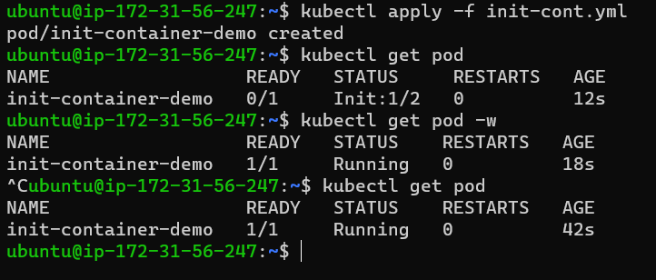

* Writing YAML files to describe the status is referred as declarative approach, k8s also supports imperative approach.
  ```
  kubectl run nginx --image=nginx --restart=Never
  ```
  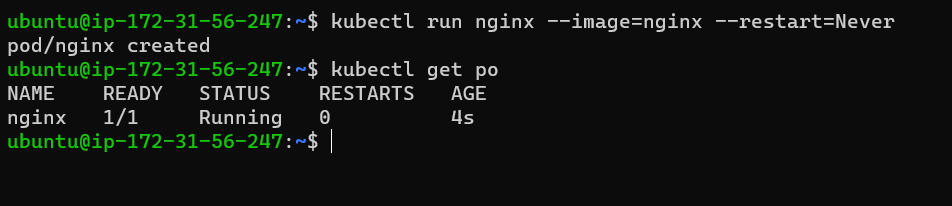

* [Refer Here](https://kubernetes.io/docs/reference/generated/kubectl/kubectl-commands#run) for some example imperative commands.

Kubernetes Networking Model
-----------------------------
* [Refer Here](https://sookocheff.com/post/kubernetes/understanding-kubernetes-networking-model/) to understand the internals of kubernetes networking
* K8s dictates following
   * all Pods can communicate with all other Pods without using network address translation (NAT).
   * all Nodes can communicate with all Pods without NAT.
   * the IP that a Pod sees itself as is the same IP that others see it as.
* All the Pods in the k8s cluster have a CIDR Range
* To implement these k8s takes linux kernel networking features such as netfilter and iptables.

Labels
-------
* In k8s as part of metadata we can apply labels to the resources.
* These labels help in querying resources based on conditions according labels defined.
* Lets create 2 pod specs with label specifications 
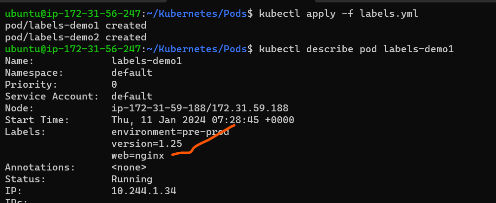
  
Replication Controller
----------------------
* Replication Controller is the first gen replica workload for k8s objects.
* Replication Controller labels can be matched only on equality not set based [Refer Here](https://kubernetes.io/docs/concepts/overview/working-with-objects/labels/#set-references-in-api-objects)
* We are writing Podspec in replication controller but why are we giving selector? Beause if 3 pods with same label are running already but replication is 5 it will only create 2 more pods.
* [Refer Here](https://kubernetes.io/docs/concepts/workloads/controllers/replicationcontroller/) for official docs
* There are many cases where we would want to run multiple instance of a application.
* In k8s we run application in Pod and to set mutlple instances we use replica sets or replication controllers.
* Lets try to run 5 nginx Pods in our cluster.
* [refer here](https://github.com/tejaswini1811/Kubernetes/blob/main/ReplicationController/nginx-rc.yml) for manifest.
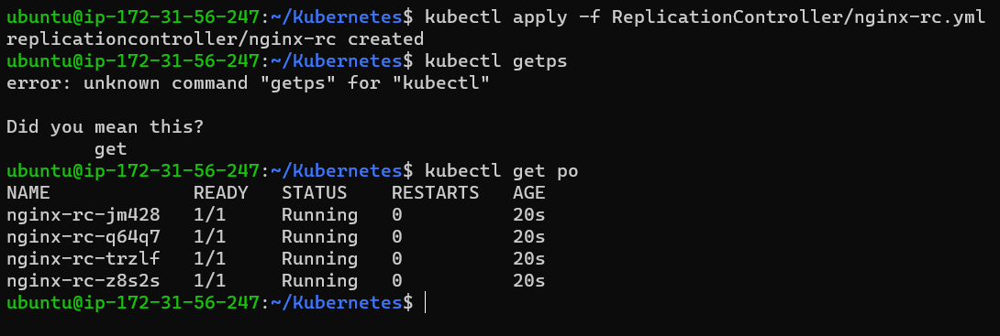

ReplicaSets
-----------
* This is succesor to Replication Controller.
* Replica Sets are used by Deployments.
* Replica Sets changes can be tracked and that is what the deployment uses.
* [Refer Here](https://kubernetes.io/docs/concepts/workloads/controllers/replicaset/) for the official docs
* Lets create a replicaset with 6 nginx Pods. [Refer Here](https://github.com/tejaswini1811/Kubernetes/commit/441c5bc77ace205f84aa5ea2a80a416e7e3a2684) for the changes
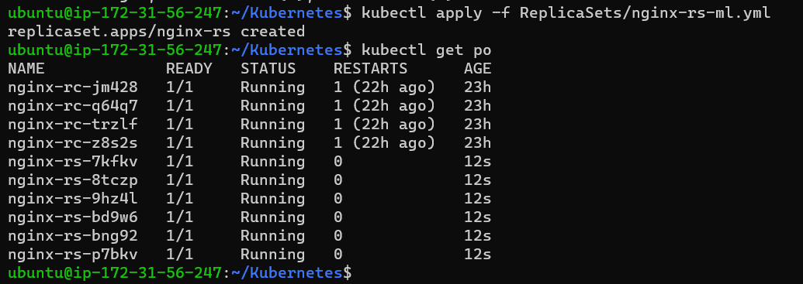
* k8s replica set will always try to maintain the desired count. Of the desired is not matching with actual state, a new Pods can be created or existing pods can be deleted to maintain the desired state
* Scaling number of replicas
   1. imperative way: Through cli
      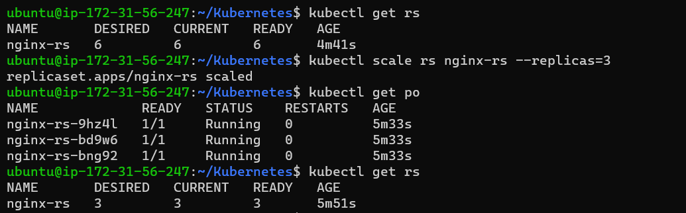
   2. declarative way: Change the spec and apply the spec again.
      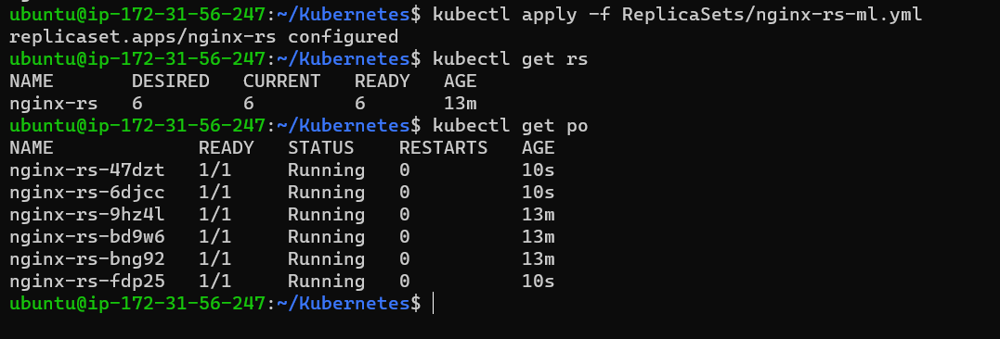 

* **Example:** Create a replica set with Pod specification with jenkins Pod and ping -c 4 google.com in alpine as init container with restart policy Never.
 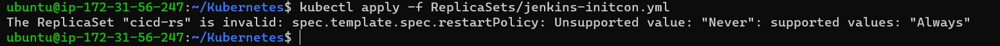
* Removed restartpolicy and applied
 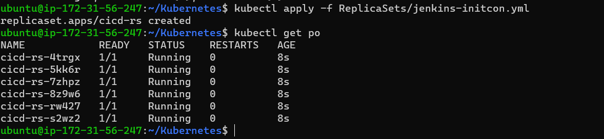.
* I deleted the rs and re-apply it. but I'm getting like below.
  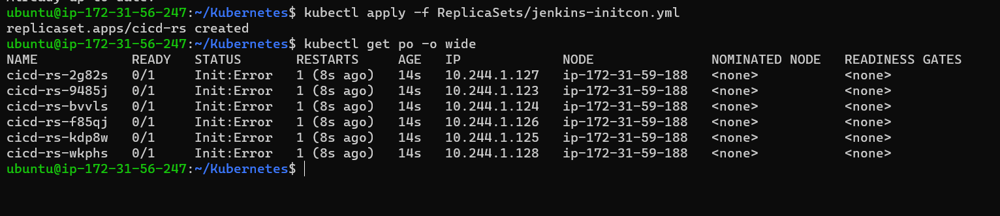 
* Getting inside Containers
```
kubectl exec -it <pod-name> -- <shell /bin/bash /bin/sh>
kubectl exec <pod-name> -- <linux command>
```
Kubernetes Service
------------------
* Overview
  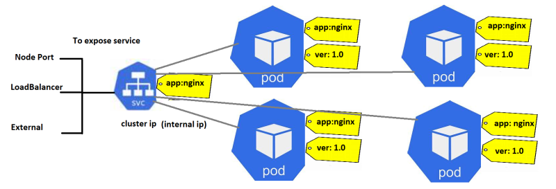
* Lets use the replica set with 4 nginx replicas and create a cluster ip service which creates an internal ip accesssible within k8s cluster [Refer Here](https://github.com/tejaswini1811/Kubernetes/blob/main/Service/clusterip.yml)
* Create and verify replica set with pods.
  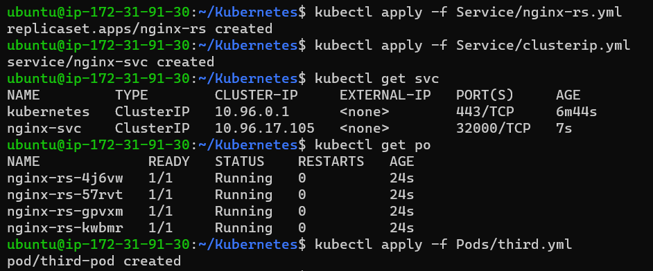
* This svc can be verified only by some Pod in k8s cluster. Lets create an experiment pod.
* Check for accessing nginx svc using ip.
  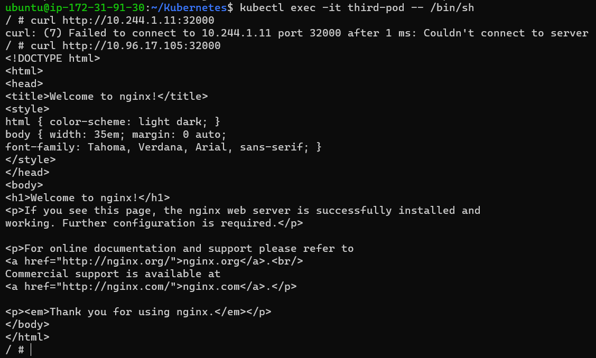
* K8s can expose the service to the external world
  
  **1. nodePort:** Expose the service to the particular port on all the nodes of k8s cluster
  
  **2. loadBalancer:** Exposes the service to the loadbalancer

  **3. external:** Creates a DNS record which can be added to DNS servers maintaine by your org.
* Created a clusterip, we can expose the application within the cluster.
* Expose the above service to the nodes. 
* [Refer Here](https://github.com/tejaswini1811/Kubernetes/blob/main/Service/nodeport.yml) for the changes
  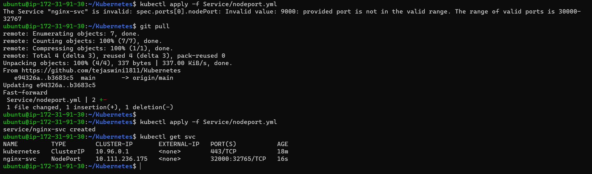
  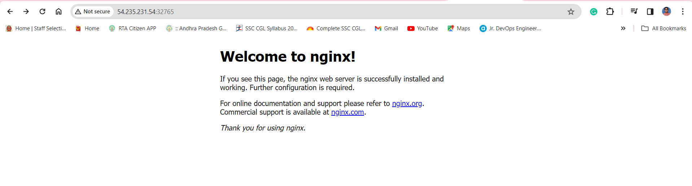
* How nodeport will work.
  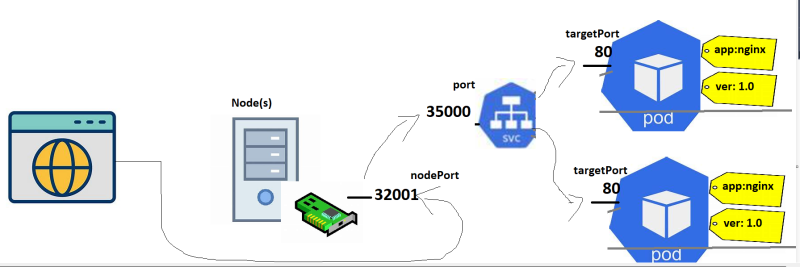.
* **LoadBalancer service** in in k8s will give an extrenal ip with which we can access application through internet.
*  Created the loadbalancer service using EKS. For EKS cluster creation is explained below.
*  [Refer here](https://github.com/tejaswini1811/Kubernetes/blob/main/Service/loadbalancer.yml) for the loadbalancer manifest.
  
  

Kubernetes as a Service
----------------------- 
* In k8s cluster we have
   * master nodes/control plane
   * nodes
* Making master nodes highly available is our responsibilty and adding authorizations, addons etc is our responsibility.
* K8s as a service is where Cloud provider manages Master nodes/cluster and HA. They also provide features for integrating k8s with other cloud services. The upgrades to the k8s cluster are easier to handle. 
* For nodes they charge usual virtual machine costs.
* Some clouds charge hourly for control plane.
  
Elastic Kubernetes Service
--------------------------
* [Refer Here](https://docs.aws.amazon.com/eks/latest/userguide/create-cluster.html) for creating EKS cluster.
* create a VPC.
  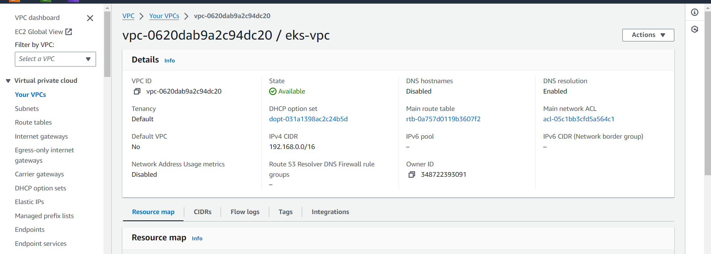
* Create subnets allowing auto assign public ip.
  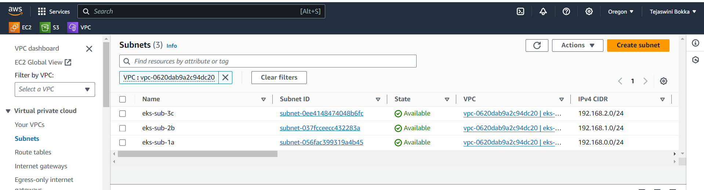
  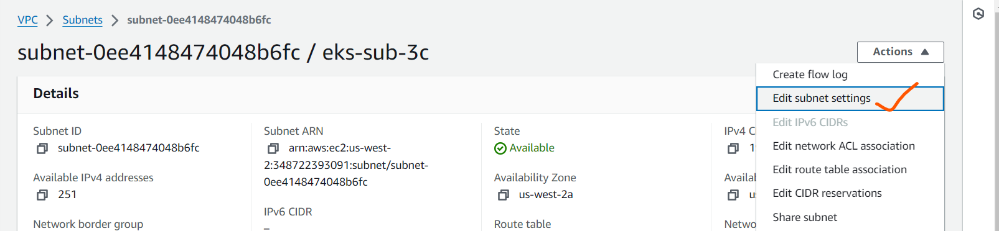
  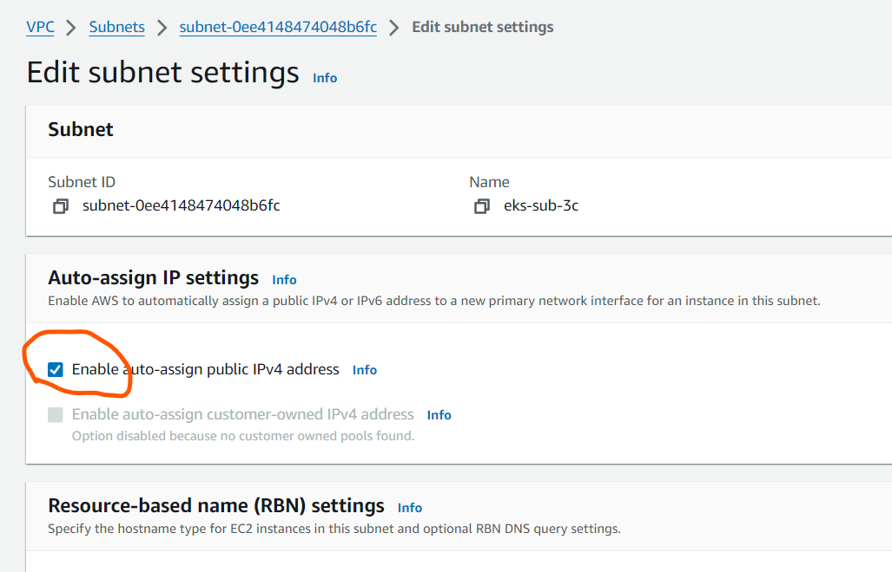
* create a security group.
* creare Internet gateway and attach that with VPC. and add route in route table.
  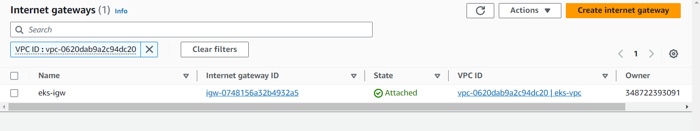
  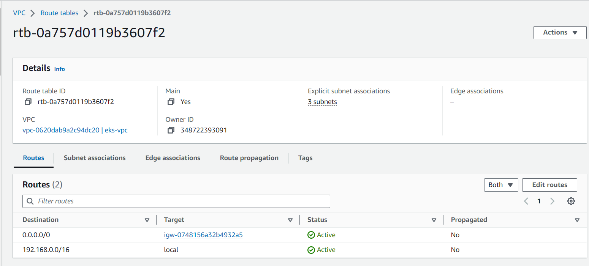
* Create an IAM role for EKS Cluster.
  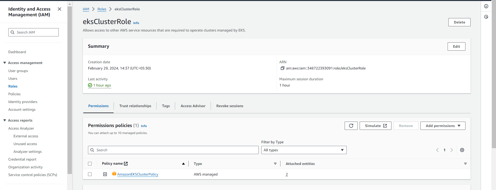
* Create an IAM role for EKS Nodes.
  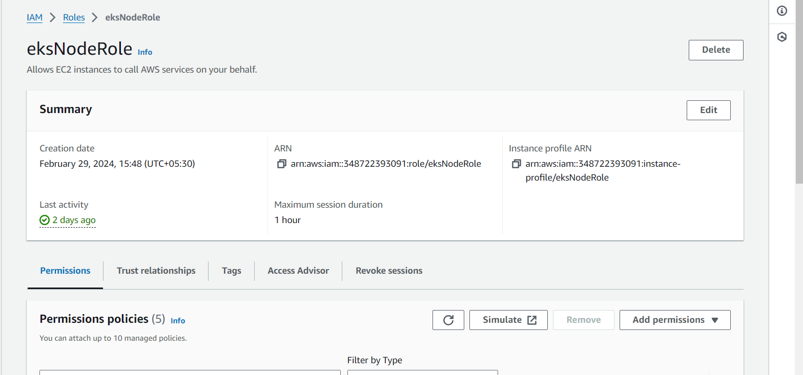
* [Refer Here](https://docs.aws.amazon.com/eks/latest/userguide/view-kubernetes-resources.html#view-kubernetes-resources-permissions) for the detailed information on creating a policy with eks view access.  
```
{
    "Version": "2012-10-17",
    "Statement": [
        {
            "Effect": "Allow",
            "Action": [
                "eks:ListFargateProfiles",
                "eks:DescribeNodegroup",
                "eks:ListNodegroups",
                "eks:ListUpdates",
                "eks:AccessKubernetesApi",
                "eks:ListAddons",
                "eks:DescribeCluster",
                "eks:DescribeAddonVersions",
                "eks:ListClusters",
                "eks:ListIdentityProviderConfigs",
                "iam:ListRoles"
            ],
            "Resource": "*"
        },
        {
            "Effect": "Allow",
            "Action": "ssm:GetParameter",
            "Resource": "arn:aws:ssm:*:348722393091:parameter/*"
        }
    ]
}
```
* create an  IAM policy with above one.
  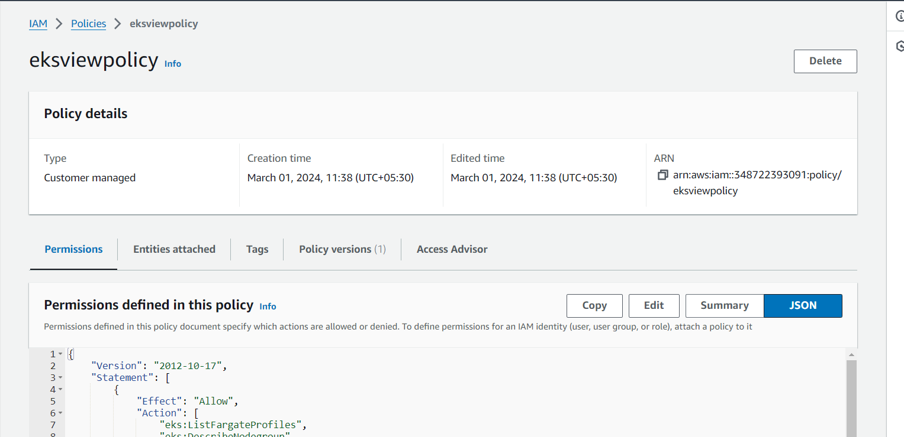
* create an IAM User with administrator access and attach the above created policy.
  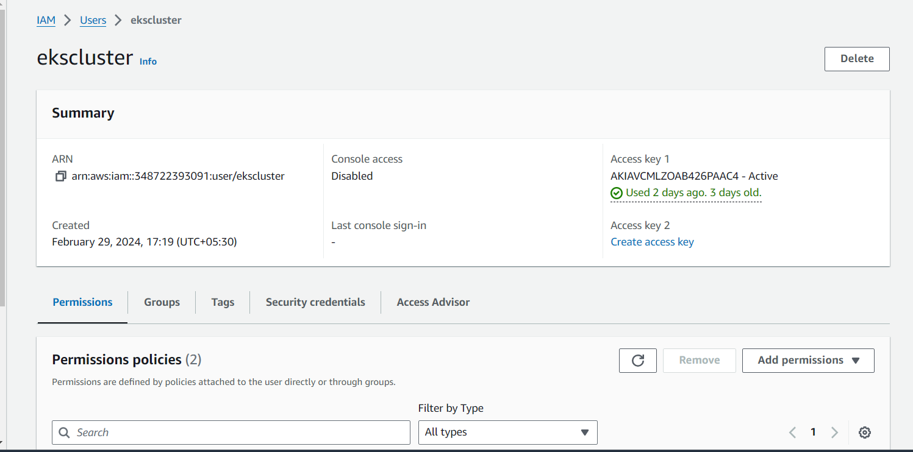
  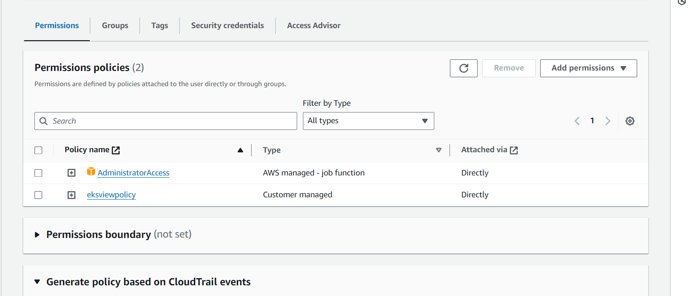
* Install AWS CLI and configure aws with access key and secrete key.
* Install kubectl in your server to connect with our cluster.
  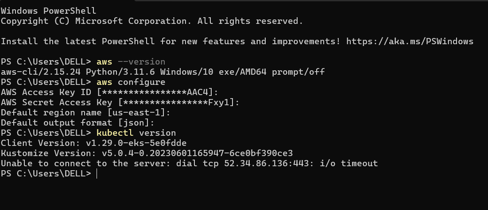
* Following cmd is used to create k8s cluster using cli.
  ```
  aws eks create-cluster --region us-west-2 --name my-cluster --kubernetes-version 1.29 --role-arn arn:aws:iam::348722393091:role/eksClusterRole --resources-vpc-config subnetIds=subnet-0ee4148474048b6fc,subnet-037fcceecc432283a,subnet-056fac399319a4b45,securityGroupIds=sg-046a3b8da6e3bf57c
  ```
  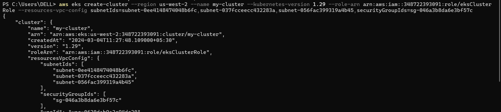
  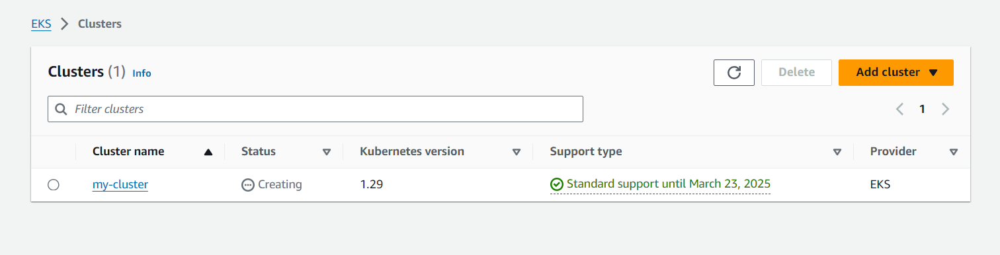
  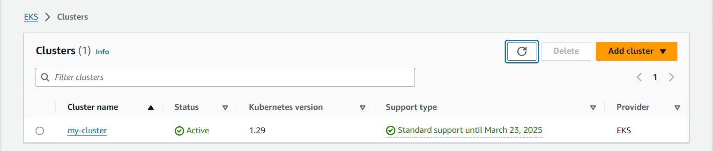
* To connect with created cluster.
 ```
 aws eks --update-kubeconfig --region uss-west-2 --name my-cluster
 kubectl get svc  (to check)
 ```
 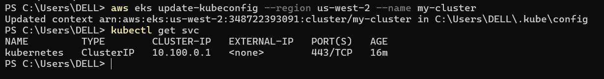
* create RBAC groups using below cmd.
  ```
  kubectl apply -f https://s3.us-west-2.amazonaws.com/amazon-eks/docs/eks-console-full-access.yaml
  kubectl apply -f https://s3.us-west-2.amazonaws.com/amazon-eks/docs/eks-console-restricted-access.yaml
  ```
  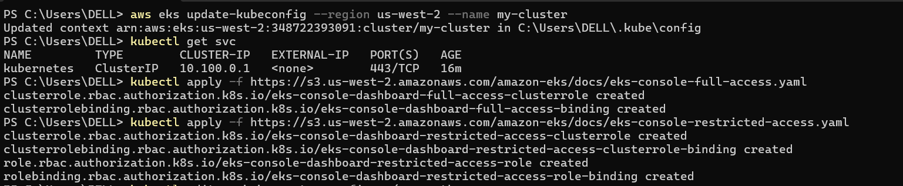 
* To create nodes I have used following cmd.
 ```
 aws eks create-nodegroup --cluster-name my-cluster --nodegroup-name my-nodes --scaling-config minSize=3,maxSize=4,desiredSize=3 --disk-size 20 --subnets "subnet-0ee4148474048b6fc" "subnet-037fcceecc432283a" "subnet-056fac399319a4b45" --instance-types t3.medium --ami-type AL2_x86_64 --remote-access ec2SshKey=eks,sourceSecurityGroups=sg-046a3b8da6e3bf57c --node-role arn:aws:iam::348722393091:role/eksNodeRole --capacity-type ON_DEMAND --region us-west-2
 ```
* Edit the config file as below. add role of above created policy and attach it to a role.
  ```
  kubectl edit -n kube-system configmap/aws-auth

  ```
 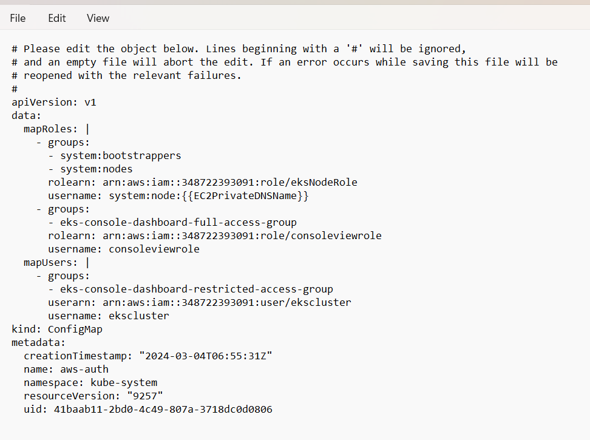

Resource Limits
---------------
* If we set the memory and CPU limits, then our pods will never be placed in a node which does not have enough space.
* In replicaset ---> spec ---> template ---> spec ---> resource for setting the limits and requests.
* request is minimum memory and CPU (lower limit)
* limit is maximum memory and CPU (upper limit) 
* [Refer here](https://github.com/tejaswini1811/Kubernetes/blob/main/Limits/jenkins-rs.yml) for setting the resource limits in a manifest.
  

Probes in Kubernetes
--------------------
* k8s has 3 probes
    1. liveness probe: If this check fails, Pod will restart the container
    2. readiness probe: If this fails, this Pod will not be served by k8s service.(k8s will not forward the request to that pod)
    3. startup probe: k8s allows us to check this by
         * sending a http(s) request
         * sending a tcp request
         * sending a grpc request
         * send a linux command
* [Refer Here](https://github.com/tejaswini1811/Kubernetes/blob/main/probes/jenkins-probes.yml) for example manifest.

Daemonset
---------
* This workload creates a Pod on every node in the k8s cluster
* This is generally used for running agents i.e. log agents, backup agents, heart beat/monitoring agents.
  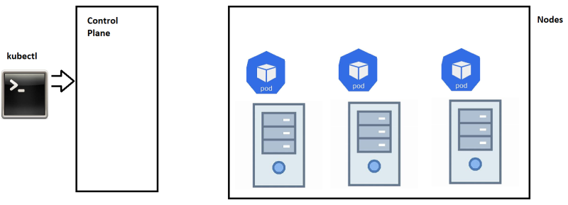
* [Refer Here](https://github.com/tejaswini1811/Kubernetes/blob/main/Daemonset/monitoring-agent.yml) for example manifest.  
  
Deployment Strategies
---------------------
* **Recreate:** Has downtime. We to stop the application, deploy the new version and start all the application instances to bring back to the working state.
* **Rolling Update:** We will define the % of application instances thatcan be down and what will be the % of app instances that can be used for new version.
*  **Blue/Green or Red/Black:** When the new version has been tested and certified to meet all the requirements, the load balancer automatically switches traffic from the older version to the newer one.
*  **A/B:**  new version is only available to a limited number of users, who are selected according to certain conditions and parameters. Location, device type, UI language, and operating system can serve as parameters for selecting these users. 
  
Deployments
-----------
* We can specify the deployment stratergy in spec. So that we can update our current version.
* We can also go back to the previous version 
* To undo rollout `kubectl rollout undo deployments/<name> --to-revision=1`(aftr changing the version)
  
* To check the history of our updates `kubectl rollout history deployments/<name>`
 

Kubernetes Namespaces
---------------------
* 
 
